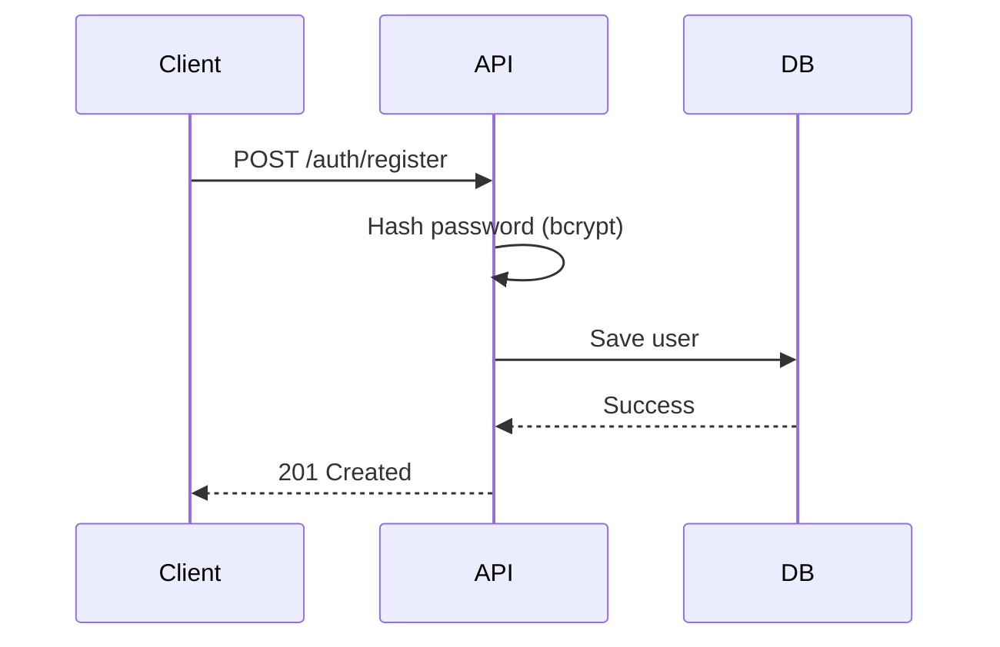
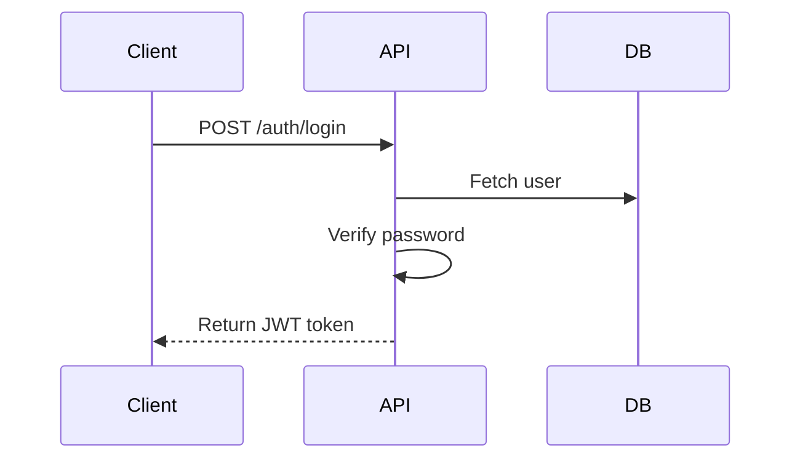
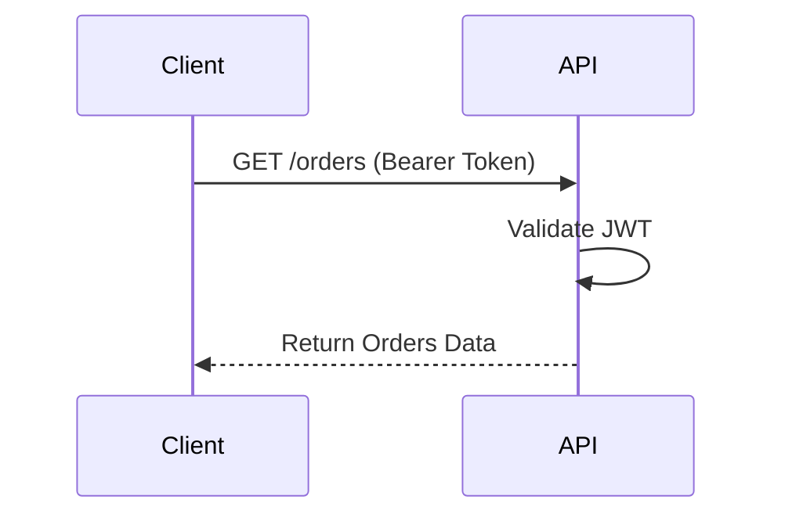

# Order Management API

A production-ready backend API built using **FastAPI** and **PostgreSQL** with JWT authentication, Docker containerization, automated testing, and CI pipeline integration.

This project demonstrates real-world backend engineering practices including authentication, database integration, containerization, testing, and continuous integration.

---

##  Features

- Health Check Endpoint
- User Registration
- User Login (JWT Authentication)
- Protected Order APIs
- PostgreSQL Database
- Dockerized Setup
- Pytest Unit Tests
- GitHub Actions CI Pipeline

---
##  Tech Stack

- **FastAPI**
- **PostgreSQL**
- **SQLAlchemy (ORM)**
- **Pydantic**
- **Passlib (bcrypt hashing)**
- **Docker & Docker Compose**
- **Pytest**
- **GitHub Actions**

---

## 🏗 System Architecture

```mermaid
flowchart LR
    Client -->|HTTP Request| FastAPI
    FastAPI -->|SQLAlchemy ORM| PostgreSQL
    FastAPI -->|JWT Authentication| Protected Routes
```

---

##  Authentication Flow

### 1️ Registration Flow



---

### 2️ Login Flow



---

### 3️ Access Protected Route



---

##  Project Structure

```
order-management-api/
│
├── app/
│   ├── api/
│   │   └── routes/
│   │       ├── auth.py
│   │       └── orders.py
│   │
│   ├── core/
│   │   ├── config.py
│   │   └── security.py
│   │
│   ├── db/
│   │   ├── models.py
│   │   └── session.py
│   │
│   ├── schemas/
│   │   ├── auth.py
│   │   └── orders.py
│   │
│   └── main.py
│
├── tests/
├── docker-compose.yml
├── Dockerfile
├── requirements.txt
└── pytest.ini
```

---

##  Running Tests

### Local

```bash
pytest
```

### Docker

```bash
docker compose up -d --build
docker compose exec api pytest
```

---

##  CI Pipeline

GitHub Actions automatically:

- Spins up PostgreSQL service
- Installs dependencies
- Runs tests
- Validates pull requests

---

## Roadmap

- Add Redis caching
- Add Role-Based Access Control
- Add API rate limiting
- Add production deployment (Render / Fly.io)